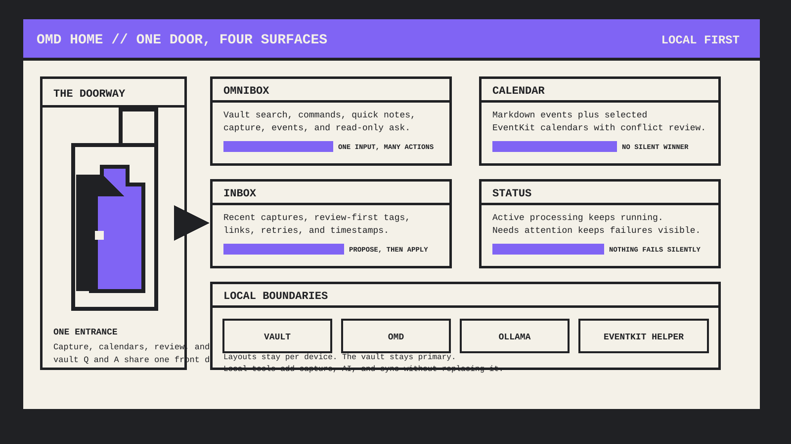
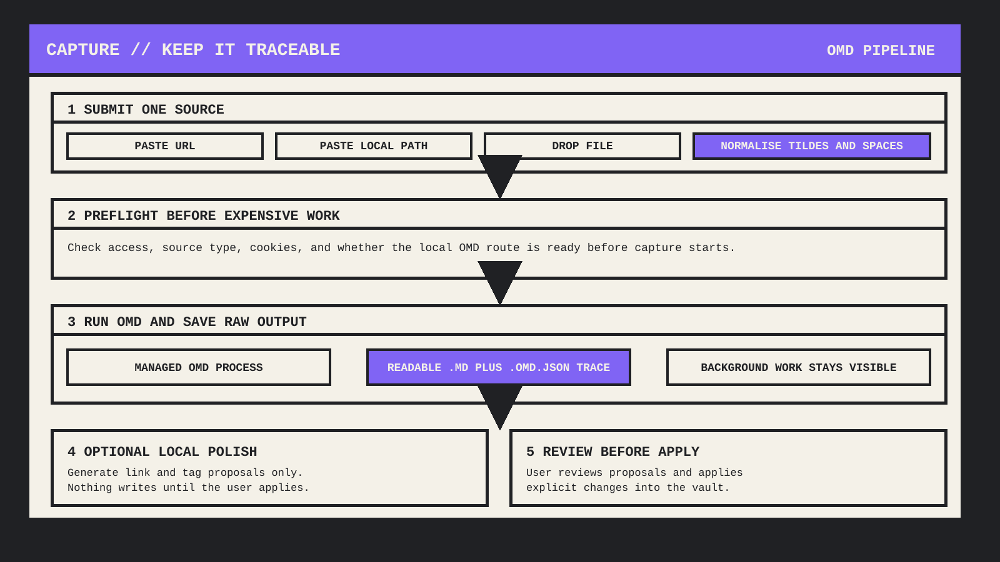
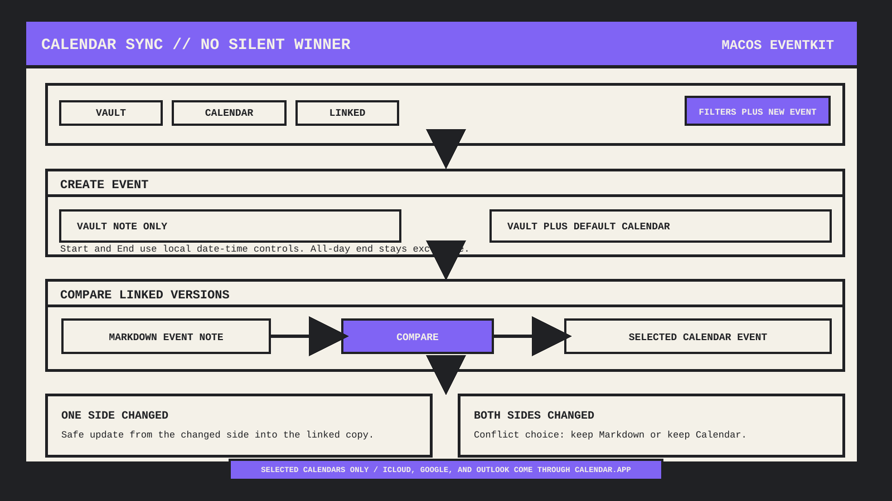
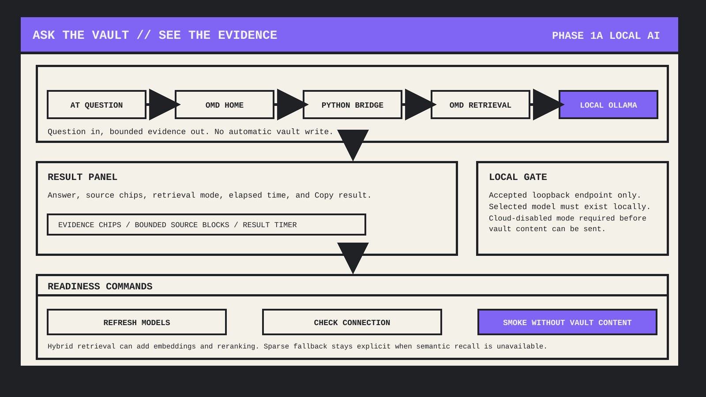

<div align="center">


<sub>OMD HOME // PUBLIC BETA 0.1.0</sub>

# OMD Home

**One front door for capture, calendars, review, and questions grounded in your vault.**

The paper-with-a-door icon is the product in miniature: one controlled entrance into work you already own.

Bring sources in. See the day. Ask with evidence. Review every proposed write.
Your Markdown files remain the source of truth.

[](https://github.com/omd-local/obsidian-omd-home/actions/workflows/ci.yml)
[](https://github.com/omd-local/obsidian-omd-home/releases/latest)
[](https://obsidian.md/)
[](LICENSE)

[Install](#install) ·
[See the rooms](#one-doorway-four-rooms) ·
[Configure](#choose-your-setup) ·
[Test](docs/manual-test-plan.md) ·
[Report an issue](https://github.com/omd-local/obsidian-omd-home/issues)

</div>

> [!IMPORTANT]
> OMD Home is a desktop-only plugin. Home, Markdown events, capture, and local
> AI work on supported desktop platforms. Apple Calendar integration requires
> macOS 14 or newer and the separately built EventKit helper. Until OMD Home is
> listed in Obsidian Community Plugins, install it from GitHub Releases.
>
> OMD Home does not install, update, or bundle OMD, Python, Ollama, or the EventKit helper.

## One doorway, four rooms

OMD Home is a doorway, not a second vault. Capture, calendar, review, and
local Q&A share one controlled entrance while Obsidian remains the source of truth.



### Four rooms, one source of truth

| Surface | What it is for |
|---|---|
| **Home** | A centered dashboard for Today, Upcoming, Recent notes, Pinned notes, Vault tags, system health, and the work that needs attention. |
| **Omnibox** | Vault search, Obsidian and community commands, quick notes, URL or file capture, event creation, recording commands, and read-only `@` vault questions. |
| **Calendar** | Month, week, day, and list views for Markdown events plus explicitly selected macOS calendars. |
| **Inbox** | Recent OMD captures plus review-first link and tag suggestions for notes that are still in the Inbox flow. |

Widgets use a 12-column grid, move occupied cards out of the way, and keep their
layout per device viewport. Standard sizes are always available from each
widget menu, so a desktop layout does not have to fit a different screen.

## Bring sources in. Decide what changes.

Paste a URL, paste a local path, or drop a file onto Home. OMD Home starts a
managed OMD process, reports progress, and leaves conversion ownership with
[Markdown Everything](https://github.com/omd-local/markdown-everything).

The boundary stays narrow: only the URL or file you submit enters, and nothing
new is written back without review.



- URL capture contacts only the source you submit. A local file capture reads
  only the path you submit.
- Drag and drop, `~/` paths, and shell-escaped spaces are normalized without
  evaluating a shell command.
- Capture continues when the Home tab is backgrounded or closed. Cancel,
  plugin unload, or quitting Obsidian stops plugin-owned child work.
- **Suggest links and tags** is proposal-only. Nothing is written until you explicitly press **Apply**.
  New concepts stay display-only, and new tags start unchecked.
- Optional capture polish is remembered per device and is off by default.

## Calendar sync with no silent winner

Create a vault-only Markdown event or link it to a writable calendar selected
in settings. OMD Home never enables every calendar by default.



- **Vault**, **Calendar**, and **Linked** are live source filters. At least one
  source remains visible.
- Google Calendar and Outlook Calendar can participate when they have already been added to macOS Calendar.
  Their calendars must also be explicitly selected in OMD Home.
- Start and End use local date and time controls. An all-day End is the
  exclusive calendar date.
- When both linked copies change before sync, OMD Home asks which side to keep.

## Ask the vault. See the evidence.

Type `@` in the omnibox to ask a question. Vault Q&A is read-only and renders
its answer in an owned result panel with evidence chips, retrieval mode,
elapsed time, and **Copy result**.

This room is intentionally conservative. The answer can inspect local evidence,
but it does not get to silently rewrite the vault.



Hybrid retrieval can combine sparse recall with a locally installed embedding
model. If semantic recall fails, OMD Home labels the sparse fallback instead of
claiming a hybrid result. Optional semantic reranking is off by default.

Phase 1a local AI allows only the default local Ollama endpoints:
`http://localhost:11434` and `http://127.0.0.1:11434`. Before any vault content
is sent, OMD Home verifies that Ollama is reachable, the selected model exists
locally, and requires Ollama Cloud to be disabled. It does not silently switch
models or fall back to a hosted provider.

Settings provide:

- **Refresh** model discovery from the live local daemon.
- **Check** connection, version, and cloud-disabled readiness.
- **Smoke** checks that do not send vault content.

## Install

### From a GitHub release

1. Download `main.js`, `manifest.json`, and `styles.css` from the
   [latest release](https://github.com/omd-local/obsidian-omd-home/releases/latest).
2. Create `<your-vault>/.obsidian/plugins/omd-home/`.
3. Put the three files directly in that folder.
4. In Obsidian, open **Settings > Community plugins**, reload installed
   plugins, and enable **OMD Home**.
5. Run **OMD Home: Open home** from the command palette.

The release tag must exactly match the version in `manifest.json`, without a
`v` prefix. The plugin release contains no executable helper, model, Python
runtime, or OMD installation.

### From source

```bash
git clone https://github.com/omd-local/obsidian-omd-home.git
cd obsidian-omd-home
npm ci
npm run build
```

If you also want to test Apple Calendar integration from source on macOS, build
the helper before installing into the repository test vault:

```bash
npm run build:eventkit
npm run install:test-vault
```

`npm run install:test-vault` copies `main.js`, `manifest.json`, `styles.css`,
and the built `dist/omd-eventkit` helper into this repository's disposable
`test-vault/`.

## Choose your setup

OMD Home starts with useful vault-only features. Add local tools only for the
workflows you want.

| Capability | Minimum setup | Boundary |
|---|---|---|
| Home, search, commands, quick notes, Markdown events | Obsidian desktop | Current vault only |
| URL and file capture | A configured or discoverable OMD executable | Submitted URL or file; URLs contact their source |
| Link and tag proposals | A compatible OMD executable and local Ollama | Review-first; no write before Apply |
| Vault Q&A | OMD with retrieval support, a Python interpreter, and local Ollama | Bounded evidence over loopback; read-only |
| Hybrid retrieval | A local embedding model selected in settings | Derived vectors stay local; query vectors are not persisted |
| Apple Calendar sync | macOS 14+, EventKit helper, Calendar permission | Explicitly selected calendars only |
| Google or Outlook calendar sync | Account already added to macOS Calendar | Uses the same selected EventKit calendars |

<details>
<summary><strong>LOCAL AI SETUP // Ollama, models, and readiness</strong></summary>

1. Install and start Ollama.
2. Install a completion model yourself. For example:

   ```bash
   ollama pull qwen3:4b-instruct
   ```

3. To use hybrid retrieval, install a local embedding model such as `bge-m3`.
4. In **Settings > OMD Home > Local AI**, press **Refresh models** and choose
   a model for each workflow.
5. Press **Check connection**, then use the row-level **Smoke** actions. Smoke
   tests send no vault content.
6. Leave the Python bridge override blank to use the bridge bundled in
   `main.js`. OMD Home derives the Python interpreter from the configured OMD
   launcher when that launcher has a direct Python shebang. Otherwise, set an
   explicit Python executable.

OMD Home requires a verifiable local-only Ollama daemon. Put the following in
`~/.ollama/server.json`, preserve any unrelated keys, fully quit and reopen
Ollama, then run **Check connection** again:

```json
{
  "disable_ollama_cloud": true
}
```

OMD Home does not auto-pull, auto-install, or auto-select models. Incompatible
and stale saved models remain visible with an actionable status.

</details>

<details>
<summary><strong>CALENDAR SETUP // EventKit and selected accounts</strong></summary>

Build the helper on macOS:

```bash
npm run build:eventkit
```

For a development vault, `npm run install:test-vault` installs
`dist/omd-eventkit` beside the plugin. For another vault, build the helper
first, then copy the executable
to `.obsidian/plugins/omd-home/omd-eventkit` or select its absolute path in OMD
Home settings.

Then:

1. Grant Calendar permission when macOS asks.
2. Press **Refresh calendars**.
3. Enable only the calendars OMD Home may read.
4. Choose one writable calendar as the default destination for linked events.

Windows and Linux keep Markdown calendar features but do not expose Apple
Calendar controls.

</details>

## Platform support

| Platform | Available now |
|---|---|
| **macOS 14+** | Home, capture, Inbox, omnibox, Markdown events, local AI, and optional selected-calendar sync |
| **Windows and Linux desktop** | Home, capture, Inbox, omnibox, Markdown events, and local AI; no Apple Calendar integration |
| **iPhone and iPad** | Not supported in v0.1 because the plugin depends on desktop child processes and filesystem APIs |

## Commands and status

The command palette exposes the main workflows without requiring the Home view
to be open:

- **Open home** and **Focus omnibox**
- **Open calendar**, **Create event**, and **Sync linked calendar events**
- **Capture URL or file** and **Cancel active OMD action**
- **Suggest links and tags**
- **Refresh local AI models**, **Check local AI connection**, and
  **Test local AI embeddings**
- **Refresh macOS calendars**

The omnibox **Commands** action also searches commands from Obsidian core and
enabled community plugins. Recording reuses Obsidian's own toggle or explicit
Start and Stop commands; OMD Home does not create a second recorder.

**Current task** shows only active work and its Cancel action. **Needs
attention** owns unresolved failures with a timestamp, safe source label,
details, and the right recovery action for that failure, such as capture retry,
Local AI checks, or Calendar follow-up. Missing or incompatible OMD, Ollama,
model, bridge, and EventKit states surface there instead of failing silently.

## Privacy and failure boundaries

- No OMD Home telemetry, ads, account creation, or payment flow.
- No automatic helper install, executable update, model pull, or model switch.
- No hosted-provider fallback in Phase 1a.
- OMD Home reads and writes only the current vault, except when it launches a
  local executable you configured or discovered.
- Optional EventKit integration uses local macOS permissions and only the
  calendars selected in OMD Home.
- URL conversion is local-first, not offline: OMD contacts the URL you submit.
- Review-first note enrichment sends only bounded note content, ranked candidate metadata, and bounded vault tags to the configured local OMD executable.
- Local AI receives bounded note content and metadata over an accepted loopback
  Ollama endpoint. Review generated answers, links, and tags before relying on
  them.
- Disabling or reloading the plugin and quitting Obsidian cancel plugin-owned
  child work. Closing only the Home tab does not.

## Development and release

```bash
npm ci
npm run typecheck
npm run lint
npm test
npm run build
```

Optional helper workflows:

```bash
npm run build:eventkit
npm run install:test-vault
```

To check the copied OMD enrichment contract fixtures without writing:

```bash
node scripts/sync-omd-contract-fixtures.mjs /path/to/omd
```

After reviewing upstream contract and validator changes, accept an intentional
fixture update with `--accept`.

| Read this | When you need it |
|---|---|
| [Manual test plan](docs/manual-test-plan.md) | Exact desktop QA, local AI benchmarks, background work, reload, and unload cases |
| [Release checklist](docs/release-checklist.md) | Community Plugins packaging, privacy, compatibility, and release gates |
| [Security policy](SECURITY.md) | Supported versions and private vulnerability reporting |
| [Third-party notices](THIRD_PARTY_NOTICES) | Licences and notices for bundled third-party components |

GitHub release assets contain exactly `main.js`, `manifest.json`, and
`styles.css`. External helpers remain optional manual prerequisites and must not
be assumed present after a Community Plugins install.

## License

OMD Home is source-available under the
[PolyForm Shield License 1.0.0](LICENSE). Company-wide internal use is
permitted. You may not use OMD Home to provide or market a product or service
that competes with OMD Home or the OMD product family without a separate
license from the copyright holders.

The licence text controls if this summary and the licence differ. Third-party
components remain under their own licences; see
[THIRD_PARTY_NOTICES](THIRD_PARTY_NOTICES).

<div align="center">

**BRING SOURCES IN -> SEE THE DAY -> ASK WITH EVIDENCE -> KEEP CONTROL**

[Download](https://github.com/omd-local/obsidian-omd-home/releases/latest) ·
[Read about OMD](https://github.com/omd-local/markdown-everything) ·
[Report a bug](https://github.com/omd-local/obsidian-omd-home/issues) ·
[PolyForm Shield License](LICENSE)

</div>
